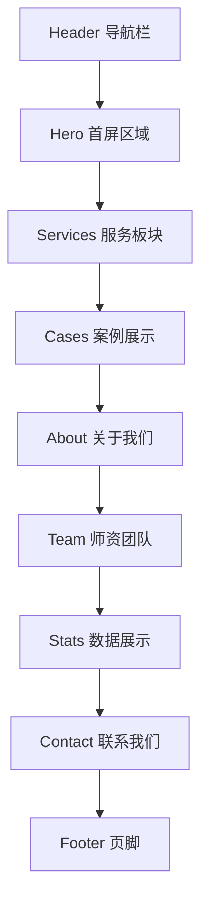

# 设计文档

## 概述

Power国际艺术教育官网采用现代化的单页应用（SPA）风格静态网站架构，使用 HTML5 + CSS3 + JavaScript 构建。

**视觉风格参考：斯芬克艺术留学**

网站设计采用简洁、明亮、专业的现代风格：
- **配色方案**: 以白色为主背景，搭配深灰/黑色文字，品牌色采用活力橙色或蓝色作为强调色
- **布局风格**: 大量留白、卡片式布局、网格化案例展示
- **字体风格**: 中文使用思源黑体/苹方，英文使用 Montserrat，层级分明
- **图片风格**: 高质量学员作品大图展示，悬浮效果增强交互感
- **整体调性**: 专业、国际化、年轻有活力，不沉闷

## 架构

### 技术栈

- **HTML5**: 语义化标签结构
- **CSS3**: Flexbox/Grid布局、CSS变量、动画
- **JavaScript**: 原生ES6+，无框架依赖
- **构建**: 纯静态文件，无需构建工具

### 文件结构

```
/
├── index.html          # 主页面
├── css/
│   ├── style.css       # 主样式文件
│   ├── variables.css   # CSS变量定义
│   └── responsive.css  # 响应式样式
├── js/
│   ├── main.js         # 主逻辑
│   └── data.js         # 内容数据
├── images/
│   ├── logo.svg        # 公司Logo
│   ├── hero/           # 首屏背景图
│   ├── cases/          # 案例图片
│   └── team/           # 团队照片
└── README.md           # 项目说明
```

### 页面结构



## 组件与接口

### 1. Header 导航组件

```javascript
// 导航栏组件接口
interface HeaderComponent {
  logo: string;           // Logo图片路径
  navItems: NavItem[];    // 导航项列表
  isScrolled: boolean;    // 是否滚动状态
  isMobileMenuOpen: boolean; // 移动端菜单状态
}

interface NavItem {
  label: string;          // 显示文本
  href: string;           // 锚点链接
  isActive: boolean;      // 是否当前激活
}
```

### 2. Hero 首屏组件

```javascript
interface HeroComponent {
  title: string;          // 主标题
  subtitle: string;       // 副标题
  ctaText: string;        // CTA按钮文字
  ctaLink: string;        // CTA链接
  backgroundImage: string; // 背景图片
}
```

### 3. Services 服务板块组件

```javascript
interface ServiceCard {
  icon: string;           // 图标
  title: string;          // 服务名称
  description: string;    // 服务描述
  link: string;           // 详情链接
}
```

### 4. Cases 案例展示组件

```javascript
interface CaseItem {
  id: string;             // 唯一标识
  studentName: string;    // 学员姓名
  university: string;     // 录取院校
  major: string;          // 专业方向
  thumbnail: string;      // 缩略图
  images: string[];       // 作品图片列表
  category: string;       // 分类（用于筛选）
}

interface CaseFilter {
  categories: string[];   // 可选分类
  activeCategory: string; // 当前选中分类
}
```

### 5. Team 师资组件

```javascript
interface TeamMember {
  name: string;           // 姓名
  title: string;          // 职位
  avatar: string;         // 头像
  background: string;     // 背景介绍
  specialties: string[];  // 专业领域
}
```

### 6. Contact 联系组件

```javascript
interface ContactInfo {
  address: string;        // 地址
  phone: string;          // 电话
  email: string;          // 邮箱
  wechatQR: string;       // 微信二维码图片
}

interface ContactForm {
  name: string;           // 姓名
  phone: string;          // 联系电话
  email: string;          // 邮箱（可选）
  message: string;        // 咨询内容
}
```

## 数据模型

### 网站配置数据

```javascript
const siteConfig = {
  siteName: "Power国际艺术教育",
  tagline: "让艺术梦想照进现实",
  contact: {
    address: "北京市朝阳区xxx大厦",
    phone: "400-xxx-xxxx",
    email: "info@powerart.edu",
    wechat: "powerart_edu"
  },
  social: {
    weibo: "https://weibo.com/powerart",
    xiaohongshu: "https://xiaohongshu.com/powerart"
  }
};
```

### 服务数据

```javascript
const services = [
  {
    icon: "portfolio",
    title: "作品集培训",
    description: "一对一定制化作品集指导，助力申请世界顶尖艺术院校"
  },
  {
    icon: "study-abroad", 
    title: "艺术留学",
    description: "全程留学规划服务，从选校到签证一站式解决"
  },
  {
    icon: "foundation",
    title: "艺术基础课程",
    description: "系统化艺术基础训练，夯实创作根基"
  }
];
```

### 案例数据

```javascript
const cases = [
  {
    id: "case-001",
    studentName: "张同学",
    university: "皇家艺术学院",
    major: "服装设计",
    category: "fashion",
    thumbnail: "images/cases/case-001-thumb.jpg",
    images: ["images/cases/case-001-1.jpg", "images/cases/case-001-2.jpg"]
  }
  // ... 更多案例
];
```


## 视觉设计规范

### 配色方案

```css
:root {
  /* 主色调 - 明亮简洁 */
  --color-bg-primary: #FFFFFF;        /* 主背景白色 */
  --color-bg-secondary: #F8F9FA;      /* 次级背景浅灰 */
  --color-bg-dark: #1A1A2E;           /* 深色区块背景 */
  
  /* 文字颜色 */
  --color-text-primary: #1A1A2E;      /* 主文字深色 */
  --color-text-secondary: #6C757D;    /* 次级文字灰色 */
  --color-text-light: #FFFFFF;        /* 浅色文字 */
  
  /* 品牌强调色 */
  --color-accent: #FF6B35;            /* 活力橙 - CTA按钮 */
  --color-accent-hover: #E55A2B;      /* 悬浮状态 */
  --color-accent-alt: #4A90D9;        /* 辅助蓝色 */
  
  /* 边框与分割 */
  --color-border: #E9ECEF;            /* 边框色 */
  --color-shadow: rgba(0,0,0,0.08);   /* 阴影色 */
}
```

### 字体规范

```css
:root {
  /* 字体家族 */
  --font-primary: "PingFang SC", "Microsoft YaHei", sans-serif;
  --font-english: "Montserrat", sans-serif;
  
  /* 字号层级 */
  --text-hero: 56px;      /* 首屏大标题 */
  --text-h1: 42px;        /* 一级标题 */
  --text-h2: 32px;        /* 二级标题 */
  --text-h3: 24px;        /* 三级标题 */
  --text-body: 16px;      /* 正文 */
  --text-small: 14px;     /* 小字 */
  
  /* 行高 */
  --line-height-tight: 1.2;
  --line-height-normal: 1.6;
  --line-height-loose: 1.8;
}
```

### 间距系统

```css
:root {
  --space-xs: 8px;
  --space-sm: 16px;
  --space-md: 24px;
  --space-lg: 48px;
  --space-xl: 80px;
  --space-xxl: 120px;
  
  /* 容器最大宽度 */
  --container-max: 1200px;
  --container-narrow: 800px;
}
```

### 动画效果

```css
:root {
  /* 过渡时间 */
  --transition-fast: 0.2s ease;
  --transition-normal: 0.3s ease;
  --transition-slow: 0.5s ease;
  
  /* 悬浮效果 */
  --hover-lift: translateY(-8px);
  --hover-scale: scale(1.02);
}
```

## 页面区块设计

### 1. Header 导航栏

- **样式**: 固定顶部，白色背景，滚动后添加阴影
- **Logo**: 左侧，品牌名 + 图标
- **导航**: 右侧水平排列，悬浮下划线效果
- **CTA按钮**: 右侧"免费咨询"按钮，橙色填充
- **移动端**: 汉堡菜单，全屏覆盖式导航

### 2. Hero 首屏区域

- **布局**: 全屏高度，左文右图或全屏背景
- **背景**: 高质量艺术作品/学生创作场景图，添加渐变遮罩
- **标题**: 大字号品牌标语，白色或深色
- **副标题**: 简短服务描述
- **CTA**: 双按钮（"立即咨询" + "了解更多"）
- **动画**: 文字淡入上移效果

### 3. Services 服务板块

- **布局**: 三列卡片式布局
- **卡片样式**: 白色背景，圆角，悬浮阴影效果
- **图标**: 线性图标或插画风格
- **交互**: 悬浮时卡片上移，阴影加深

### 4. Cases 案例展示（重点区块）

- **布局**: 瀑布流/网格布局，参考斯芬克案例页
- **筛选**: 顶部标签式筛选（全部/服装/平面/建筑/工业等）
- **卡片**: 
  - 大尺寸作品图片
  - 悬浮显示学员信息和录取院校
  - 点击展开详情模态框
- **加载**: 图片懒加载，骨架屏占位

### 5. About 关于我们

- **布局**: 左右分栏，图文结合
- **内容**: 公司简介、发展历程时间轴
- **数据展示**: 大数字 + 描述（学员数、录取率、合作院校）
- **动画**: 数字滚动增长效果

### 6. Team 师资团队

- **布局**: 四列卡片
- **卡片**: 圆形头像 + 姓名 + 职位 + 简介
- **交互**: 悬浮显示详细背景

### 7. Contact 联系我们

- **布局**: 左侧联系信息，右侧咨询表单
- **表单**: 简洁设计，浮动标签
- **二维码**: 微信公众号/客服二维码
- **地图**: 可选嵌入高德地图

### 8. Footer 页脚

- **布局**: 深色背景，多列布局
- **内容**: 快速链接、联系方式、社交媒体、版权信息

## 响应式断点

```css
/* 桌面端 */
@media (min-width: 1200px) { }

/* 平板横屏 */
@media (max-width: 1199px) and (min-width: 992px) { }

/* 平板竖屏 */
@media (max-width: 991px) and (min-width: 768px) { }

/* 手机端 */
@media (max-width: 767px) { }
```


## 正确性属性

*属性是指在系统所有有效执行中都应保持为真的特征或行为——本质上是关于系统应该做什么的形式化陈述。属性是人类可读规范与机器可验证正确性保证之间的桥梁。*

基于需求文档的验收标准分析，以下是可测试的正确性属性：

### Property 1: 案例筛选结果一致性

*对于任意*筛选条件（专业方向或院校），筛选后返回的所有案例都应该属于该筛选条件对应的分类。

**验证: 需求 2.3**

### Property 2: 表单验证完整性

*对于任意*表单输入组合，当任一必填字段（姓名、联系方式、咨询内容）为空或仅包含空白字符时，表单验证应返回失败状态。

**验证: 需求 4.2**

### Property 3: 触摸目标尺寸合规性

*对于任意*可点击/可交互元素，在移动端视口下，该元素的可触摸区域尺寸应不小于44x44像素。

**验证: 需求 5.4**

## 错误处理

### 图片加载失败

- 显示占位图片或品牌色背景
- 保持布局稳定，不产生布局偏移

### 表单提交失败

- 由于是静态网站，表单提交使用第三方服务（如 Formspree）或 mailto 链接
- 显示友好的错误提示信息
- 保留用户已填写的内容

### JavaScript 禁用

- 核心内容仍可访问
- 导航链接使用锚点，无JS也可跳转
- 渐进增强策略

## 测试策略

### 单元测试

使用 Jest 进行单元测试：

- 表单验证函数测试
- 案例筛选逻辑测试
- 数据格式化函数测试

### 属性测试

使用 fast-check 进行属性测试：

- 每个属性测试运行至少100次迭代
- 测试注释格式: `**Feature: power-art-education-website, Property {number}: {property_text}**`

**测试文件结构:**
```
/tests/
├── unit/
│   ├── form.test.js      # 表单验证测试
│   └── filter.test.js    # 筛选逻辑测试
└── property/
    ├── filter.property.test.js  # 筛选属性测试
    └── form.property.test.js    # 表单属性测试
```

### 视觉测试

- 手动检查各断点下的布局
- 检查图片显示质量
- 验证动画效果流畅性

### 可访问性测试

- 使用 Lighthouse 检查可访问性评分
- 验证键盘导航
- 检查颜色对比度
